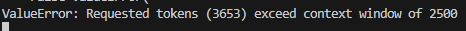

# Система DOCQA (Чат-Бот) на базе КОАП города Москвы.

**Задача:**  Сделать систему DOCQA на базе КОАП города Москвы.

**Ожидаемый результат:**
Ответ бота должен содержать ответ на вопрос, номер статьи, референсный фрагмент.

**Рекомендуемый Стек (Требования)**:
- Фреймворк - Langchain;
- Интерфейс – Gradio;
- Модель – Llama(Сайга) GGML

# Разработка системы
Принцип работы разработанной системы представлен на рисунке 1:
 

Для решения поставленной задачи первым этапом был подготовлен скрипт, выполняющий преобразование текста из pdf формата в txt.
Разработанный код PDFExtractor.py используюет в качестве входных данных url на pdf файл. А в качестве выходных данных представляет два txt файла. Первый txt файл сохраняет разметку pdf. Второй txt файл полностью удаляет все вспосмогательные символы. Это необходимо для более точного распознования схожести текста с вопрсом.

Вторым этапом был разработан скрипт ChatBot.py. Он состоит из нескольких функций.
1. Первым этапом он обрабатывает входные данные из txt или pdf файла прежде, чем превратить их в векторное представление. Для этого алгоритм предварительно разбивает входной текст на сплиты\чанки. Для разбиения текста на чанки один из классов библиотеки langchain был модифицирован согласно представленному тексту. Теперь данные в тексте разбивались не случайным образом согласно заданной длине чанка, а согласно семантической структуре документа, а именно по статьям. Подбное решение позволило модели получать более точные сематические прогнозы.
2. Вторым этапом полученные сплиты подвергаются обработке с помощью алгоритма **paraphrase-multilingual-mpnet-base-v2** и превращаются в векторное представление (эмбеддинги), а затем обрабатываются с помощью STS алгоритма Chroma.
3. Третьим этапом загружается модель Llama2-saiga-gguf-7b. Выполняется настройка модели согласно заданным гиперпараметрам.
4. Четвертым этапом создается чат интерфейс.

# Тестирование системы

Несмотря на то, что не выполнялось дополнительное переобучение модели (finetune), система все равно показывает неплохие результаты при ответе на вопросы пользователя. Далее представлены вопросы, с которыми система справилась на отлично:

----

----

----

----

----

----

----
Однако в некоторых  случаях модель отвечала на вопрос вполне правильно, соответствуя контексту, однако некоторые нюансы были неверны (например номер статьи):

В данном случае модель верно ответила на вопрос, но неверно указала номер статьи.

В некоторых случаях модель может ответить неправльно:

----

----

В данном случае модель семантически правильно перечисляет статьи, однако согласно данным статьям размер штрафа отличается от того, что в  впоросе.

В некоторых случаях модель может выдавать ошибку:

----

----

Что вполне решается банальным увеличением числа токенов.

А иногда модель может выдать странный ответ:

В данном случае модель ответила вопосом на вопрос. Возможно это можно решить калибровкой промта

В данном случае модель ответила ответила верно, однако непонятно откуда она взяла информацию в кавычках. Попытка найти что-то подобное в интернете не увенчалось успехом. Возможно модель сгенерировала ответ или воспользовалась встроенной базой,  найти подобную формулировку в исходном документе так же не удалось.

В целом модель верно отвечает на большинство предложенных вопросов, однако в некоторых случаях все еще может ошибаться
